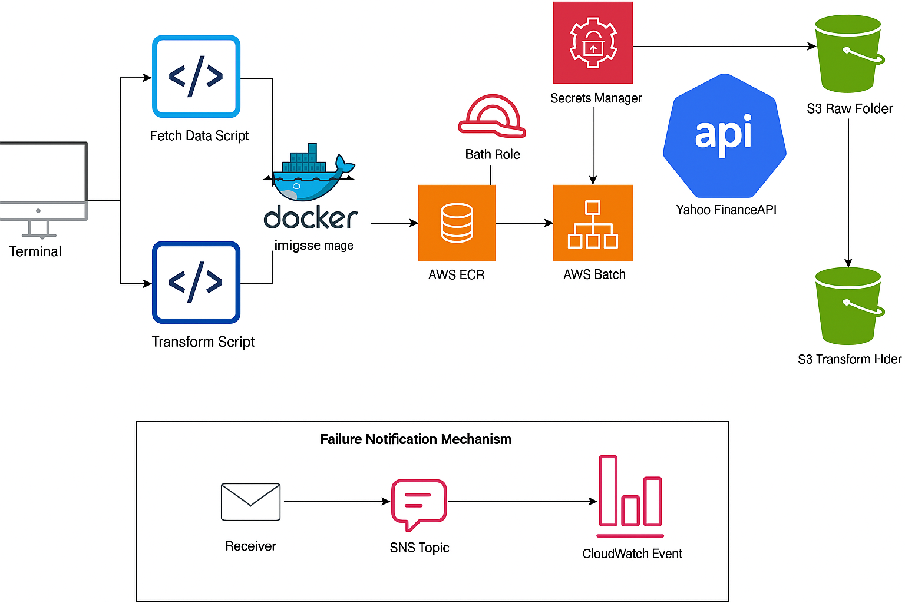

# 📈 Yahoo Finance Data Pipeline on AWS

This project builds a robust, Dockerized data pipeline to fetch and transform stock data from the Yahoo Finance API, orchestrated using AWS Batch, and monitored via CloudWatch and SNS. It's designed for scalability, reliability, and seamless integration into AWS cloud environments.

---

## 🧰 Tech Stack

- **Python** – Fetching and transforming stock data
- **Docker** – Containerizing scripts
- **AWS Batch** – Job orchestration
- **AWS ECR** – Image registry
- **AWS S3** – Data storage (raw & transformed)
- **AWS Secrets Manager** – API key management
- **AWS CloudWatch + SNS** – Failure monitoring and alerting

---

## 📊 Architecture



1. **Terminal (CLI)** triggers Docker build and AWS Batch job.
2. **Fetch Script** pulls data from Yahoo Finance using secure credentials from Secrets Manager.
3. **Transform Script** cleans and structures the data.
4. **Docker** image is built and pushed to **AWS ECR**.
5. **AWS Batch** runs the containerized job.
6. Processed and raw data are stored in **Amazon S3**.
7. **CloudWatch** monitors job status; on failure, **SNS** sends alerts to subscribed channels (email/SMS).

---

## 🚀 How to Use

### 🔧 Step 1: Clone the Repository

```bash
git clone https://github.com/Shiva-prakash-perumal/Yahoo_finance_aws_docker.git
cd Yahoo_finance_aws_docker
```

### 🐳 Step 2: Build Docker Image

```bash
docker build -t yahoo-finance-pipeline .
```

### 📦 Step 3: Push Image to AWS ECR

```bash
aws ecr get-login-password --region <region> | docker login --username AWS --password-stdin <aws_account_id>.dkr.ecr.<region>.amazonaws.com
docker tag yahoo-finance-pipeline <ecr_repo_url>
docker push <ecr_repo_url>
```

### ☁️ Step 4: Create Batch Environment

- Choose **Fargate**
- Assign `AWSServiceRoleForBatch`
- Set job role with `ecs-tasks.amazonaws.com` trust

### 📄 Step 5: Submit Batch Job

Manually or through EventBridge/CloudWatch

---

## 📂 Project Structure

```
.
├── fetch_data.py
├── transform_data.py
├── Dockerfile
├── diagram.png
├── README.md
```

---

## 📡 Failure Notifications

If a Batch job fails:
- **CloudWatch Events** detect the failure
- **SNS Topic** triggers
- **Email/SMS/Slack alerts** are sent to registered receivers

---

## 💡 Improvements To Explore

- Add schema validation before writing to S3
- Schedule jobs using EventBridge
- Visualize trends using Amazon QuickSight or Streamlit
- Implement retries for transient API failures

---

## 🙋‍♂️ Author

**Shiva Prakash Perumal**  
[GitHub](https://github.com/Shiva-prakash-perumal) | [LinkedIn](https://linkedin.com/in/shiva-prakash-perumal)

---

## 🪪 License

This project is licensed under the [MIT License](LICENSE).